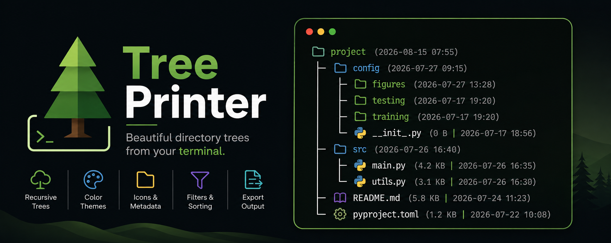
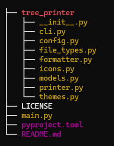

# 🌲 Tree Printer

<p align="center">
  
  <br>
  <sub><i>Banner generated using ChatGPT</i></sub>
</p>

[](https://github.com/AmirmasoudCS/Tree-Printer/releases)
[](https://github.com/AmirmasoudCS/Tree-Printer/actions/workflows/tests.yml)
[](LICENSE)
[](https://www.python.org/)

A lightweight and customizable command-line utility for generating beautiful directory tree structures directly from your terminal.

Tree Printer makes it easy to visualize project layouts, document repositories, create examples for documentation, and inspect filesystem structures with optional icons, metadata, filtering, sorting, and color themes.

---

## ✨ Features

- 🌳 Generate recursive directory trees
- 📁 Display directories only
- 👁️ Show or hide hidden files
- 🚫 Exclude files, directories, or file extensions
- 📏 Limit recursion depth
- 🔤 Sort entries by:
  - Name
  - Size
  - Last modified date
- 📊 Display file size
- 🕒 Display modification timestamps
- 🎨 Multiple color themes
- 🖼️ Optional file and folder icons
- 📝 Export output to text files
- 🚫 Respect `.gitignore`
- ⚡ Fast and lightweight
- 🧪 Fully tested with pytest
- 🔄 Continuous Integration using GitHub Actions

---

## 📦 Installation

### From PyPI (Recommended)

```bash
pip install directory-tree-printer
````

### From source

```bash
git clone https://github.com/AmirmasoudCS/Tree-Printer.git

cd Tree-Printer

pip install .
```

---

## 🚀 Quick Start

Print the current directory

```bash
tp .
```

Print another directory

```bash
tp path/to/project
```

Print only directories

```bash
tp --dirs-only
```

Show icons

```bash
tp --icons
```

Show file sizes

```bash
tp --size
```

Limit depth

```bash
tp --max-depth 2
```

Save output

```bash
tp --output tree.txt
```

---

## 📖 Examples

### Basic

```bash
tp .
```

```text
project
├── src
│   ├── main.py
│   └── utils.py
├── README.md
└── pyproject.toml
```

---

### Icons

```bash
tp --icons
```

```text
📁 project
├── 📁 src
│   ├── 🐍 main.py
│   └── 🐍 utils.py
├── 📘 README.md
└── ⚙️ pyproject.toml
```

---

### File Sizes

```bash
tp --size
```

```text
README.md (5.8 KB)
main.py (4.2 KB)
config.py (831 B)
```

---

### Modified Dates

```bash
tp --modified
```

```text
README.md (2026-05-12 18:42)
main.py (2026-05-11 14:30)
```

---

### Themes

```bash
tp --theme sunset
```



---

## ⚙️ CLI Options

| Option               | Alias | Description                         |
| -------------------- | ----- | ----------------------------------- |
| `--max-depth`        | `-md` | Limit recursion depth               |
| `--show-hidden`      | `-sh` | Include hidden files                |
| `--dirs-only`        | `-do` | Show only directories               |
| `--exclude-dirs`     | `-ed` | Exclude directories                 |
| `--exclude-files`    | `-ef` | Exclude files                       |
| `--exclude-suffixes` | `-es` | Exclude file extensions             |
| `--sort`             | `-st` | Sort by name, size or modified      |
| `--size`             | `-s`  | Display file sizes                  |
| `--modified`         | `-m`  | Display modified dates              |
| `--icons`            | `-i`  | Display icons                       |
| `--theme`            | `-th` | Select a color theme                |
| `--no-color`         | `-nc` | Disable colored output              |
| `--gitignore`        | `-gi` | Ignore files listed in `.gitignore` |
| `--output`           | `-o`  | Write output to a file              |
| `--version`          | `-v`  | Show installed version              |

---

## 🧪 Development

Clone the repository

```bash
git clone https://github.com/AmirmasoudCS/Tree-Printer.git
```

Install development dependencies

```bash
pip install -e ".[dev]"
```

Run the test suite

```bash
pytest
```

Run tests with coverage

```bash
pytest --cov=tree_printer --cov-report=term-missing
```

Build the package

```bash
python -m build
```

Verify the package

```bash
python -m twine check dist/*
```

---

## 📂 Project Structure

```text
 
├── 📁 images
│   └── 🖼️ themeImage1.png
├── 📁 tests
│   ├── 🐍 __init__.py
│   ├── 🐍 test_cli.py
│   ├── 🐍 test_formatter.py
│   └── 🐍 test_printer.py
├── 📁 tree_printer
│   ├── 🐍 __init__.py
│   ├── 🐍 cli.py
│   ├── 🐍 config.py
│   ├── 🐍 file_types.py
│   ├── 🐍 formatter.py
│   ├── 🐍 icons.py
│   ├── 🐍 models.py
│   ├── 🐍 printer.py
│   └── 🐍 themes.py
├── 📘 CHANGELOG.md
├── ⚖️ LICENSE
├── 🐍 main.py
├── ⚙️ pyproject.toml
├── 📘 README.md
└── 📝 requirements-dev.txt
```

---

## 🛣️ Roadmap

Future improvements include:

* Additional export formats
* Custom icon packs
* More color themes
* Configuration file support
* Improved Windows terminal support
* Performance improvements for very large directories

Suggestions and pull requests are always welcome.

---

## 🤝 Contributing

Contributions, feature requests, and bug reports are welcome.

If you'd like to contribute:

1. Fork the repository
2. Create a feature branch
3. Make your changes
4. Run the test suite
5. Submit a Pull Request

---

## 📜 Changelog

See [CHANGELOG.md](CHANGELOG.md) for release history.

---

## ⚖️ License

This project is licensed under the MIT License.

See [LICENSE](LICENSE) for details.

---